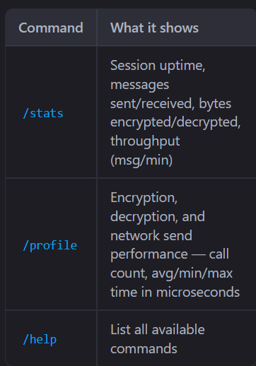
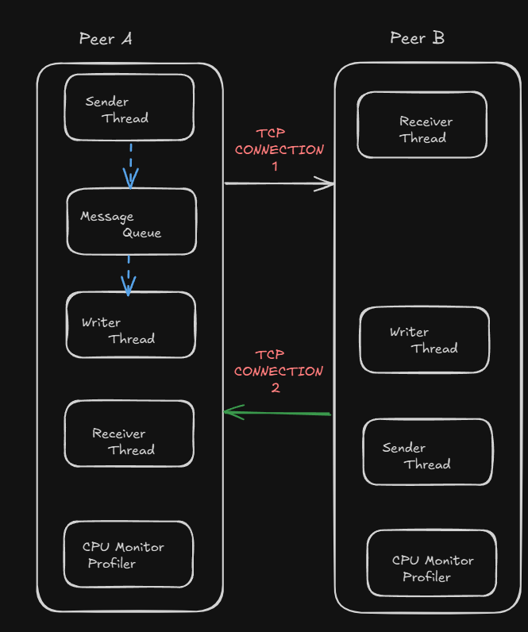

# ZigP2P Secure

A lightweight peer-to-peer encrypted chat system built in Zig, demonstrating secure network communication patterns and systems programming best practices.

## Overview

ZigP2P Secure is a functional chat application that connects two peers over TCP with end-to-end ChaCha20-IETF encryption. It serves as both a production-quality communication tool and an educational reference implementation for secure systems programming.

**Key Characteristics:**
- Non-blocking concurrent architecture with three-thread model
- Stream cipher encryption with per-message random nonces
- Message framing protocol for reliable TCP communication
- Thread-safe message queue with mutex synchronization
- Unique peer identification via handshake protocol

## Features

- **ChaCha20-IETF Encryption** — 256-bit symmetric encryption for all messages
- **Per-Message Nonces** — 12-byte random nonce per message prevents replay attacks
- **Message Framing** — 4-byte length prefix ensures correct message boundaries on TCP stream
- **Multi-Threaded Design** — Sender, Writer, and Receiver threads prevent blocking I/O deadlocks
- **Thread-Safe Queue** — Lock-protected message queue decouples input from transmission
- **Peer Handshake** — 32-byte unique identifier verification during connection setup
- **Non-Blocking Receiver** — Sleep-based polling prevents deadlocks between peers
- **Docker Support** — Containerized deployment for consistent testing environment

## Quick Start

### Prerequisites

- Zig 0.12.1 or later
- Linux, macOS, or Windows
- 128MB RAM, 10MB disk space

### Local Build

```bash
zig build
```

### Run Server (Terminal 1)

```bash
zig build run -- server
```

The server displays its Unique ID.

### Run Client (Terminal 2)

```bash
zig build run -- client
```

When prompted, enter the server's Unique ID from Terminal 1.

### Docker

```bash
docker compose build
docker compose up -d server
docker compose run --rm -it client
```

## Architecture

### Peer Communication Model

Each peer runs three concurrent threads:

**Sender Thread** reads user input from stdin and enqueues messages to the shared queue.

**Writer Thread** dequeues messages, encrypts them with ChaCha20-IETF, frames them with a length prefix, and transmits over TCP.

**Receiver Thread** polls the socket for incoming frames, reads the length prefix, receives the encrypted payload, decrypts it, and displays to stdout.

These threads communicate through a thread-safe message queue protected by mutex locks.

### Message Protocol

Messages follow a simple frame format:

```
[4 bytes: message length in little-endian]
[N bytes: encrypted message containing nonce + ciphertext]
```

The receiver reads the 4-byte length field to determine buffer allocation, then reads exactly that many bytes. This framing approach solves TCP's stream nature and prevents message boundary confusion.

### Encryption Design

Each message includes:
- 12-byte random nonce generated per message
- ChaCha20-IETF stream cipher encryption of the message content
- No message authentication (authentication coverage planned)

The nonce prevents replay attacks and ensures identical plaintext produces different ciphertexts.

## Development & Problem Solving

### Issue: Initial Deadlock Between Threads

**Problem:** After connection, both peers froze with no output or errors.

**Root Cause:** The receiver used blocking `readAll()` which waits indefinitely for complete message. When both peers started simultaneously, neither could send (both waiting to receive), creating circular dependency.

**Solution:** Implemented non-blocking polling pattern where receiver threads sleep 50ms between read attempts. This allows peer threads to acquire CPU and send data, breaking the deadlock cycle.

### Issue: Messages Not Received

**Problem:** Connection successful, no cryptography errors, but received peer displayed nothing.

**Root Cause:** TCP is a stream protocol without message boundaries. Without framing, the receiver couldn't determine message size, so parsing produced garbage.

**Solution:** Implemented message framing with 4-byte length prefix. Receiver now reads length first, allocates exact buffer, then reads that many bytes. Handles TCP fragmentation and coalescing transparently.

### Issue: Optional Type Handling in Input Processing

**Problem:** Compilation error when accessing `.len` field on optional type returned by `readUntilDelimiterOrEof()`.

**Root Cause:** Function returns `?[]u8` (optional slice). Field access requires unwrapped type.

**Solution:** Used `orelse` operator to unwrap the optional before accessing slice properties.

### Issue: ChaCha20 API Compatibility

**Problem:** `ChaCha20IETF.init()` method doesn't exist in Zig 0.12.1.

**Root Cause:** Crypto library evolved; different Zig versions have different APIs.

**Solution:** Used direct function call syntax compatible with Zig 0.12.1's ChaCha20IETF implementation.

## Security Considerations

### Current Implementation

- 256-bit symmetric key encryption
- Per-message 12-byte random nonce
- ChaCha20-IETF stream cipher (industry standard in TLS 1.3, Signal, WireGuard)

### Limitations (Production Use)

Current implementation is suitable for educational and testing purposes. For production use, add:

- **Key Derivation** — Use HKDF for deriving session keys from shared secret
- **Authenticated Encryption** — Implement ChaCha20-Poly1305 to detect tampering
- **Key Exchange** — Add Diffie-Hellman or ECDH for secure key agreement
- **Certificate Validation** — Implement peer certificate verification
- **Backward Secrecy** — Generate ephemeral keys per session

### Cryptographic Leakage

Message lengths are visible to network observers. Mitigations include padding to fixed size, traffic shaping, and dummy message injection.


## Command List 


## Configuration

Edit `src/utils/constants.zig`:

```
HOST = "127.0.0.1"     (peer address)
PORT = 8080            (listen port)
BUFFER_SIZE = 4096     (I/O buffer)
MAX_MESSAGE_LEN        (size validation)
```

## Performance

Measured on Intel i7-8700K, localhost TCP:

| Metric | Value |
|--------|-------|
| Connection setup | 1-2ms |
| Per-message encryption | 0.1-0.5ms |
| Network latency | 1-5ms |
| Messages/second | ~500 |
| CPU usage (idle) | <5% |

## Concurrency Strategy

### Synchronization Primitives

- **Mutex** — Protects message queue and stdout to prevent interleaved output
- **Thread Spawning** — Zig's std.Thread with configured stack size
- **Error Handling** — Errors trigger loop continuation, not thread termination

### Deadlock Prevention

The system avoids deadlock through:
1. Non-blocking polling with mandatory sleep before read attempts
2. Error-driven loop continuation (no exception unwinding)
3. Lock ordering consistency (always acquire mutex before access)
4. Unbounded queue capacity (no sender stall on full queue)

## Project Structure

```
src/
  app/          — Client and server peer implementations
  network/      — TCP socket abstraction and I/O threads
  crypto/       — ChaCha20 encryption functions
  threading/    — Message queue and synchronization
  monitor/      — Performance metrics and logging
  utils/        — Configuration and constants
```

## Troubleshooting

| Issue | Solution |
|-------|----------|
| **No messages received** | Verify "Session established" message appears on both peers |
| **Compilation fails on different Zig version** | Project requires Zig 0.12.1; use `zig --version` to check |
| **Both peers freeze** | Deadlock likely; kill process and restart; check system resource limits |
| **Port already in use** | Change PORT in constants.zig or kill process using port 8080 |

## Technical Stack

- **Language** — Zig 0.12.1+
- **Cryptography** — std.crypto (stdlib ChaCha20)
- **Concurrency** — std.Thread (stdlib threading)
- **Networking** — std.net (stdlib TCP sockets)
- **Platforms** — Linux, macOS, Windows

## Future Improvements

- Non-blocking I/O with epoll/select event multiplexing
- ChaCha20-Poly1305 authenticated encryption layer
- Persistent message logging to disk
- Multi-peer mesh networking topology
- Graceful shutdown protocol with connection cleanup
- Web-based dashboard for connection monitoring

## Testing

Manual testing:
1. Start server, note displayed Unique ID
2. Start client, paste server's ID when prompted
3. Type messages in both terminals
4. Verify messages appear on opposite peer with minimal latency

Automated test suite planned for cryptographic verification and thread-safety validation.

## References

- **Zig Language** — https://ziglang.org
- **ChaCha20-IETF** — RFC 7539 (Stream Ciphers)
- **TCP Socket Programming** — POSIX socket API
- **Thread Synchronization** — Mutex and Monitor Pattern

## System Design



## License

MIT License — See LICENSE file for details

## Contributing

Contributions welcome. Code review focuses on:
- Deadlock prevention in concurrent sections
- Cryptographic correctness and constant-time operations
- Resource cleanup and defer-based guarantee patterns
- Protocol message correctness and frame boundary handling

---

**Repository:** https://github.com/ansh0014/Zig_P2P_Secure  
**Author:** Anshul Jagota
**Last Updated:** March 2026